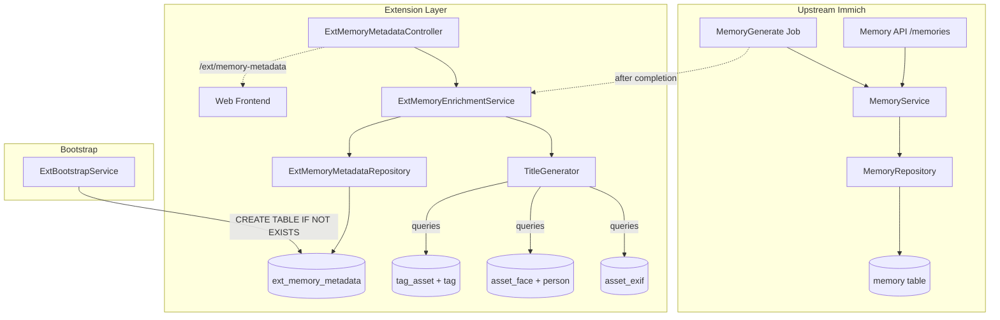
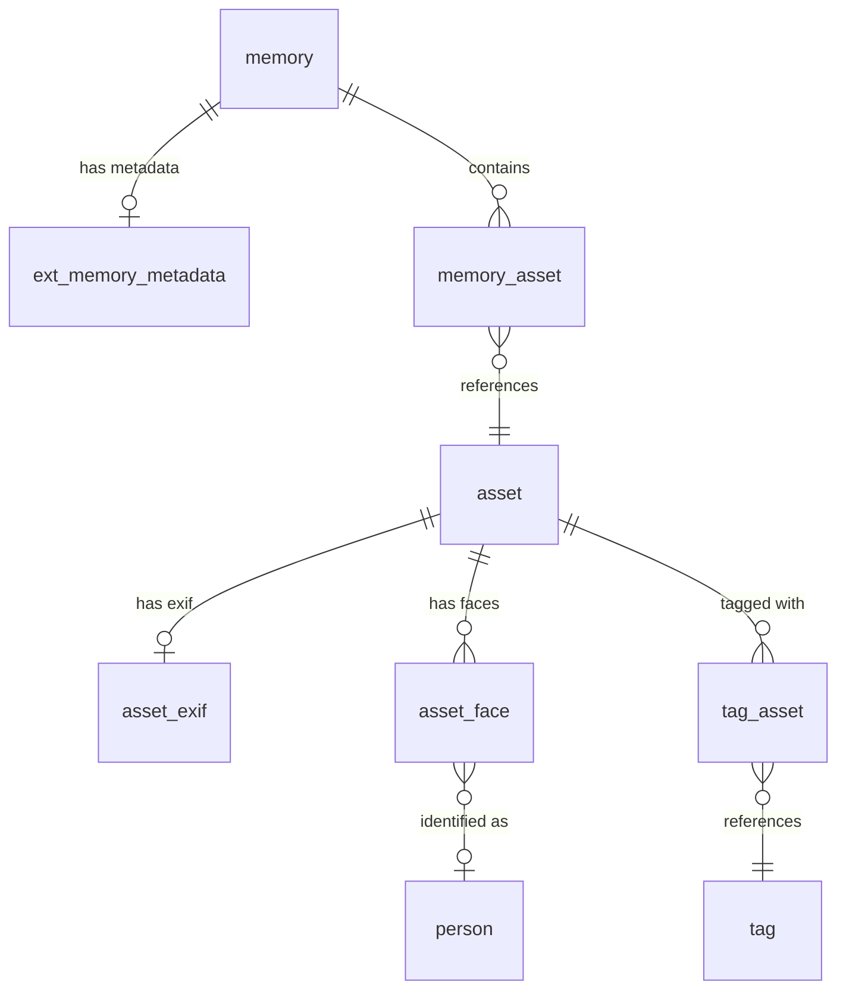

# Design Document: Extended Memory Metadata

## Overview

This feature enriches Immich memories with descriptive, context-aware titles and sub-category labels by introducing a new extension table (`ext_memory_metadata`) and an enrichment service. Instead of the generic "X years ago" label, the web frontend will display meaningful titles like "Summer in Paris" or "Day with Alex."

The design follows the fork's established extension pattern:
- A new `ext_memory_metadata` table bootstrapped via `ExtBootstrapService` (no Kysely migration entries)
- A new `ExtMemoryEnrichmentService` that generates titles using a priority-based strategy (location → people → tags → fallback)
- A new `ExtMemoryMetadataController` exposed at `/ext/memory-metadata` for the web frontend
- The standard memory API remains unchanged, preserving mobile app compatibility

## Architecture



### Key Design Decisions

1. **Separate table over extending `memory`**: Avoids modifying upstream schema. The `ext_memory_metadata` table has a 1:1 relationship with `memory` via a unique foreign key.

2. **Post-job hook over inline enrichment**: The enrichment runs after the `MemoryGenerate` job completes rather than inside it. This avoids modifying the upstream `MemoryService` and keeps enrichment failures isolated.

3. **Dedicated API endpoint over extending the standard response**: The mobile app continues to receive the unmodified `MemoryResponseDto`. The web frontend makes a second call to `/ext/memory-metadata` to fetch enriched titles. This adds one extra HTTP call but guarantees zero breaking changes.

4. **Priority-based title strategy**: Location data is most universally recognizable, followed by people names, then tags. This ordering produces the most descriptive titles with the least ambiguity.

5. **String-based sub-categories over enum**: Storing sub-categories as plain strings avoids any upstream enum modification and allows easy addition of new categories in the future.

## Components and Interfaces

### 1. ExtMemoryMetadataTable (Schema)

**File:** `server/src/schema/tables/ext-memory-metadata.table.ts`

```typescript
@Table('ext_memory_metadata')
export class ExtMemoryMetadataTable {
  id: Generated<string>;           // uuid PK
  memoryId: string;                // FK → memory.id, UNIQUE
  title: string;                   // Generated descriptive title
  subCategory: string | null;      // 'trip' | 'people_highlight' | null
  titleSource: string;             // 'location' | 'people' | 'tags' | 'fallback'
  createdAt: Generated<Timestamp>; // Auto-set on insert
  updatedAt: Generated<Timestamp>; // Auto-set on insert/update
}
```

### 2. ExtBootstrapService (Addition)

Adds the `ext_memory_metadata` CREATE TABLE statement to the existing `ensureExtensionSchema()` method. Uses `CREATE TABLE IF NOT EXISTS` — no migration entry.

### 3. ExtMemoryEnrichmentService

**File:** `server/src/services/ext-memory-enrichment.service.ts`

Responsibilities:
- Listens for the `MemoryGenerate` job completion event
- Queries memories lacking metadata in `ext_memory_metadata`
- For each memory, queries associated assets' EXIF data, face/person associations, and tags
- Delegates to `TitleGenerator` logic to produce a title and source
- Assigns a sub-category based on asset analysis
- Upserts the result into `ext_memory_metadata`

```typescript
interface EnrichmentResult {
  title: string;
  titleSource: 'location' | 'people' | 'tags' | 'fallback';
  subCategory: string | null;
}
```

### 4. Title Generation Logic

The title generator is a pure function that takes asset metadata and produces a title:

```typescript
interface AssetMetadataForEnrichment {
  city: string | null;
  country: string | null;
  personNames: string[];
  tags: string[];
}

function generateTitle(assets: AssetMetadataForEnrichment[]): EnrichmentResult;
```

**Priority algorithm:**
1. Compute city frequency across assets. If any city appears in >50% of assets, use `"${city}, ${country}"` as the title (source: `location`).
2. Otherwise, compute person name frequency. If any set of 1-3 people appear in >50% of assets, use `"Day with ${names}"` (source: `people`).
3. Otherwise, compute tag frequency. If any tag appears in >50% of assets, use that tag as the title (source: `tags`).
4. Otherwise, fall back to a date-based title (source: `fallback`).

**Sub-category classification:**
- If assets have ≥3 distinct cities → `trip`
- If people appear in >70% of assets → `people_highlight`
- Otherwise → `null`

### 5. ExtMemoryMetadataRepository

**File:** `server/src/repositories/ext-memory-metadata.repository.ts`

```typescript
interface ExtMemoryMetadataRepository {
  upsert(memoryId: string, data: EnrichmentResult): Promise<ExtMemoryMetadata>;
  getByMemoryId(memoryId: string): Promise<ExtMemoryMetadata | undefined>;
  getByMemoryIds(memoryIds: string[]): Promise<ExtMemoryMetadata[]>;
  getMemoriesWithoutMetadata(memoryIds: string[]): Promise<string[]>;
}
```

Uses Kysely's `insertInto(...).onConflict(...)` for upsert operations.

### 6. ExtMemoryMetadataController

**File:** `server/src/controllers/ext-memory-metadata.controller.ts`

```typescript
@ApiTags('Memory Metadata (Extension)')
@Controller('ext/memory-metadata')
@Authenticated()
export class ExtMemoryMetadataController {
  @Get(':id')         // Single memory metadata
  @Post('bulk')       // Batch fetch by memory IDs
}
```

### 7. Web Frontend Integration

**File:** `web/src/lib/services/ext-memory-metadata.ts` (new)

A service that calls `/ext/memory-metadata/bulk` with memory IDs and caches the results. The `memoryLaneTitle` derived store is wrapped to check for enriched titles first, falling back to the existing "X years ago" logic.

## Data Models

### ext_memory_metadata Table

| Column       | Type                     | Constraints                              |
|-------------|--------------------------|------------------------------------------|
| id          | uuid                     | PK, DEFAULT uuid_generate_v4()           |
| memoryId    | uuid                     | NOT NULL, UNIQUE, FK → memory.id CASCADE |
| title       | character varying        | NOT NULL                                 |
| subCategory | character varying        | NULLABLE                                 |
| titleSource | character varying        | NOT NULL                                 |
| createdAt   | timestamp with time zone | NOT NULL, DEFAULT now()                  |
| updatedAt   | timestamp with time zone | NOT NULL, DEFAULT now()                  |

### DTOs

```typescript
// Response DTO for extension API
interface ExtMemoryMetadataResponseDto {
  memoryId: string;
  title: string;
  subCategory: string | null;
  titleSource: string;
}

// Request DTO for bulk fetch
interface BulkMemoryMetadataRequestDto {
  memoryIds: string[];  // max 100
}
```

### Relationship Diagram



## Correctness Properties

*A property is a characteristic or behavior that should hold true across all valid executions of a system — essentially, a formal statement about what the system should do. Properties serve as the bridge between human-readable specifications and machine-verifiable correctness guarantees.*

### Property 1: Title generation respects priority ordering

*For any* set of asset metadata associated with a memory, the title generator SHALL select the title source according to priority: if a city appears in >50% of assets, titleSource is `location`; otherwise if people appear in >50% of assets, titleSource is `people`; otherwise if a tag appears in >50% of assets, titleSource is `tags`; otherwise titleSource is `fallback`. No lower-priority source is ever chosen when a higher-priority source meets the majority threshold.

**Validates: Requirements 4.1, 4.2, 4.3, 4.4, 4.5, 4.6**

### Property 2: Sub-category classification follows threshold rules

*For any* memory and its associated assets, the assigned sub-category SHALL be: `trip` if assets span ≥3 distinct cities; `people_highlight` if recognized people appear in >70% of assets (and trip condition is not met first); `null` otherwise. The sub-category is deterministic given the same asset data.

**Validates: Requirements 5.2, 5.3, 5.4**

### Property 3: Enrichment completeness

*For any* set of memories that lack metadata in `ext_memory_metadata` and have at least one associated asset, after the enrichment service processes them, each memory SHALL have exactly one corresponding record in `ext_memory_metadata`.

**Validates: Requirements 3.1**

### Property 4: Empty memories are skipped

*For any* memory with zero associated assets, the enrichment service SHALL NOT create a metadata record in `ext_memory_metadata` for that memory.

**Validates: Requirements 3.3**

### Property 5: Enrichment idempotency

*For any* memory that already has a record in `ext_memory_metadata`, running the enrichment service again SHALL result in exactly one record for that memory (no duplicates), with the `updatedAt` timestamp updated to reflect the latest run.

**Validates: Requirements 9.1, 9.2, 9.3**

### Property 6: Display title selection

*For any* memory, the display function SHALL return the enriched title from `ext_memory_metadata` when a record exists, and SHALL return the standard "X years ago" label when no record exists. The result is fully determined by the presence or absence of a metadata record.

**Validates: Requirements 6.2, 6.3**

### Property 7: API metadata retrieval correctness

*For any* list of memory IDs submitted to the extension API, the response SHALL contain the full metadata (title, subCategory, titleSource) for each memory that has a record in `ext_memory_metadata`, and SHALL return an empty/absent entry for each memory that does not.

**Validates: Requirements 8.2, 8.3**

## Error Handling

| Scenario | Handling Strategy |
|----------|-------------------|
| Memory has no associated assets | Skip enrichment silently (no metadata row created) |
| EXIF data missing for all assets in a memory | Fall through to people/tags/fallback in title priority |
| No people, no tags, no location | Generate date-based fallback title with `titleSource: 'fallback'` |
| Single memory enrichment throws | Log error, continue processing remaining memories in batch |
| Database constraint violation on upsert | Should not occur due to `ON CONFLICT UPDATE`; if it does, log and skip |
| Extension API called with invalid UUID | Return 400 Bad Request (standard validation) |
| Extension API called without authentication | Return 401 Unauthorized (same auth guard as memory API) |
| Extension API called for another user's memory | Return 403 or empty result (enforce ownership check) |
| Bootstrap table creation fails | Log fatal error; service continues but enrichment will fail gracefully |

## Testing Strategy

### Unit Tests

- **TitleGenerator function**: Test specific examples for each priority level and edge cases (all nulls, single asset, tie-breaking).
- **Sub-category classifier**: Test threshold boundaries (exactly 3 cities, exactly 70% people coverage).
- **Repository upsert logic**: Verify insert and update paths with mock database.
- **Controller DTOs**: Validate request/response serialization.
- **Display title selection**: Verify enriched vs fallback path with concrete examples.

### Property-Based Tests

Property-based testing is well-suited for this feature because:
- The title generator is a **pure function** with clear input/output behavior
- The input space is large (varying combinations of cities, people, tags across multiple assets)
- Universal properties (priority ordering, threshold classification) should hold across all valid inputs

**Library:** [fast-check](https://github.com/dubzzz/fast-check) (already available in the project's test ecosystem)

**Configuration:**
- Minimum 100 iterations per property test
- Each test tagged with: `Feature: extended-memory-metadata, Property {N}: {title}`

**Property tests to implement:**
1. Priority ordering (Property 1) — Generate random `AssetMetadataForEnrichment[]` arrays, verify the selected titleSource respects the priority chain.
2. Sub-category classification (Property 2) — Generate random asset sets with varying location/people distributions, verify sub-category assignment.
3. Enrichment completeness (Property 3) — Generate random memory batches, verify all eligible memories get metadata.
4. Empty memory skip (Property 4) — Generate memories with empty asset arrays, verify no metadata produced.
5. Idempotency (Property 5) — Run enrichment twice on the same memories, verify single record with updated timestamp.

### Integration Tests

- Bootstrap creates table successfully and is idempotent.
- Full enrichment flow: create memories with assets → run enrichment → verify metadata via API.
- Cascade delete: delete a memory → verify ext_memory_metadata row is removed.
- Standard memory API response unchanged (mobile compatibility).
- Auth enforcement on extension endpoint.

### End-to-End Tests

- Web frontend displays enriched title when available.
- Web frontend falls back to "X years ago" when no metadata.
- Memory viewer shows sub-category label when present.

